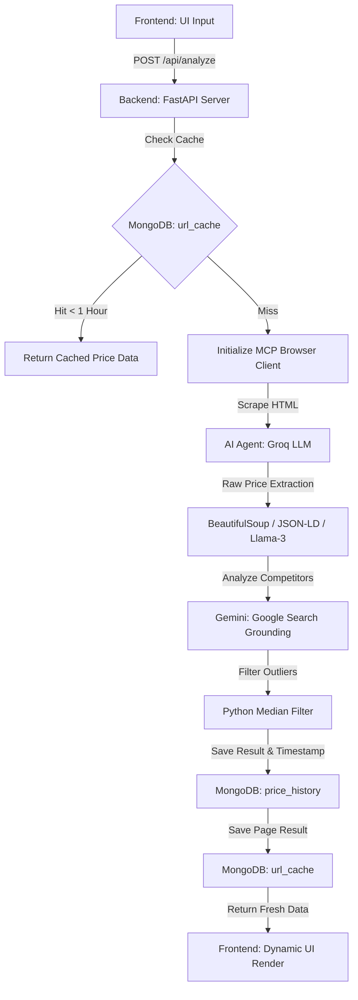

# 🛒 Autonomous AI Shopping Agent Orchestrator

A modern, full-stack, AI-powered e-commerce pricing analysis and tracking application. The system autonomously crawls product URLs, parses pricing details, queries competitor prices using Gemini with Google Search Grounding, and saves historical price details into a MongoDB Atlas database. It features a high-performance caching layer to save execution costs and response times.

---

## 📐 System Architecture & Workflow

The orchestrator utilizes a secure **Model Context Protocol (MCP)** execution framework where the LLM is given direct access to sandboxed web crawling tools, executing search loops in real-time.



---

## 📂 Project Directory Structure

The project has been reorganized into clean, isolated modules:

```
Project/
├── .agents/
│   └── skills/
│       └── shopping-agent/       # AI-Agent Skill definition
│           └── SKILL.md          # Machine-readable skill manual
├── backend/
│   ├── api_balancer.py           # API Key Rotation & Load Balancer
│   ├── db.py                     # MongoDB Connections & Schema Models
│   └── server.py                 # FastAPI Application Server & MCP Client
├── frontend/
│   ├── index.html                # Premium UI Main Dashboard
│   ├── styles.css                # Glassmorphic Custom Design & Animations
│   └── app.js                    # UI Dynamics & API Controller
├── skills/
│   ├── shopping_agent.py         # Autonomous AI Agent ReAct Loop
│   └── scraper_skill.py          # HTML Parser, Selectors, & Fallbacks
├── scripts/
│   ├── seed_db.py                # Database Seeding Utility (500+ records)
│   ├── view_db.py                # Database Reporter (generates markdown summaries)
│   └── clear_cache.py            # Cache Flusher Utility
├── debug/
│   └── price_history_report.md   # Live Compiled Database Report
├── requirements.txt              # Project Dependencies
└── .env                          # Configuration Keys (ignored in git)
```

---

## 🚀 Setup & Execution Guide

### 1. Prerequisites
* **Python 3.10+** installed.
* **Node.js** (required for `npx` execution of the browser crawler backend).
* **MongoDB Atlas** account (or local MongoDB server instance).

### 2. Installation
Install the project dependencies from the root directory:
```bash
pip install -r requirements.txt
```

### 3. Environment Configuration
Create a `.env` file in the project root:
```env
# MongoDB Atlas Database URI
MONGO_URI=mongodb+srv://<username>:<password>@cluster.mongodb.net/shopping_agent_db?retryWrites=true&w=majority

# LLM Providers Configuration
GEMINI_API_KEY=your_gemini_api_key
GROQ_API_KEY=your_groq_api_key
```

### 4. Running the Application
Start the FastAPI server via Uvicorn:
```bash
python -m uvicorn backend.server:app --reload --port 8000
```
Open your browser and navigate to:
* **Interactive Dashboard:** [http://127.0.0.1:8000](http://127.0.0.1:8000)
* **Interactive API Reference:** [http://127.0.0.1:8000/docs](http://127.0.0.1:8000/docs)

---

## ⚙️ Core Feature Explanations

### 1. Glassmorphic User Interface (`frontend/`)
* Built with pure HTML/CSS and vanilla JS. It features custom animations, dynamic skeleton loader states, and responsive cards to display pricing insights.

### 2. Autonomous Scraping & Analysis (`skills/`)
* Uses **MCP (Model Context Protocol)** with `mcp-server-fetch-typescript` to securely open and read target e-commerce pages.
* Employs fallback selectors (CSS, JSON-LD Schema, and Groq LLM heuristic text search) to reliably parse prices even if web page layouts change.

### 3. Live Price Comparison & Grounding
* Queries Gemini with Search Grounding to fetch live competitor prices across major Indian stores (Amazon, Flipkart, Croma, Vijay Sales, Reliance Digital).
* Applies a median filter to filter out pricing anomalies, returning a verified cheapest source.

### 4. Caching & Persistence (`backend/db.py`)
* Stores results inside MongoDB Atlas.
* **Cache Interceptor:** If a user searches the same URL within **1 hour**, the system serves the cached results instantly, skipping heavy scraper & API workloads.

---

## 📊 Database Statistics & Utilities

* Run the DB seeding script to generate sample historical logs:
  ```bash
  python scripts/seed_db.py
  ```
* Compile the live database statistics report:
  ```bash
  python scripts/view_db.py
  ```
  This creates/updates the [price_history_report.md](file:///c:/Users/Nayanareddy/OneDrive/Desktop/books/Project/debug/price_history_report.md) report detailing products, lowest/highest prices, and 6-month averages.
